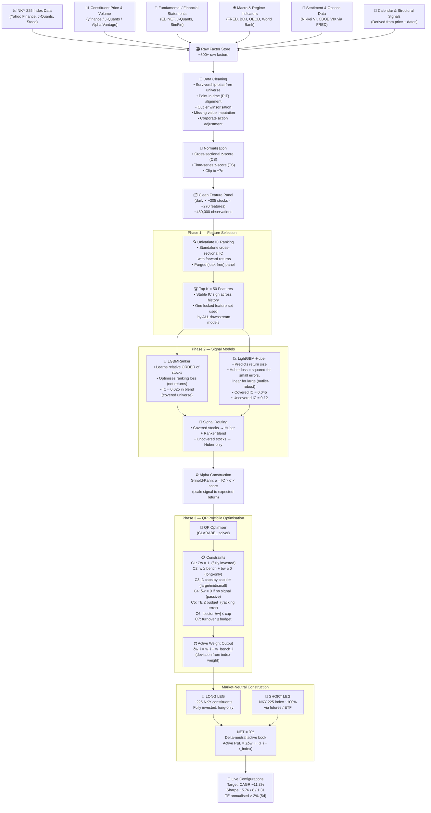

# NKY 225 Enhanced Index — ML Alpha Generation & Portfolio Optimization Blueprint

> **Goal:** Construct a market-neutral, long-only active book over the NKY 225 constituents that maximises excess return (CAGR / Sharpe) against the index using machine-learning-derived optimal weights.

---

## Full Pipeline Flowchart



---

## 1. Data Collection

### 1.1 NKY 225 Index Price Data

| Source | URL / Library | Notes |
|---|---|---|
| Yahoo Finance | `yfinance` — ticker `^N225` | Daily OHLCV, free, easy Python access |
| Stooq | `pandas_datareader` stooq driver | Clean historical data, good for backtesting |
| J-Quants API | `jquantsapi` Python client | Japan-specific, free tier, official TSE data |
| Quandl / Nasdaq Data Link | `nasdaq-data-link` | Some Japan indices available; requires API key |
| Investing.com | Web scrape / unofficial APIs | Rich history but TOS-restricted scraping |

### 1.2 NKY 225 Constituent Stock Price & Volume Data

| Source | URL / Library | Notes |
|---|---|---|
| Yahoo Finance | `yfinance` (e.g., `7203.T` for Toyota) | Free; `.T` suffix for TSE stocks |
| J-Quants API | `jquantsapi` | Best source for Japan stocks; PIT adjustments |
| Alpha Vantage | `alpha_vantage` Python client | Free tier (5 req/min); daily & intraday |
| Stooq | `pandas_datareader` | Reliable free historical OHLCV |
| EDINET | `edinet-client` | Official FSA filings; useful for events |

> **Universe:** Pull the current + historical constituent lists from J-Quants or Nikkei's published constituent history to build a **survivorship-bias-free** universe.

### 1.3 Fundamental Data (44 factors)

| Source | Coverage | Notes |
|---|---|---|
| J-Quants API (`/fins/statements`) | Income statement, balance sheet, cash flow | Best PIT source for Japan |
| EDINET (FSA) | Full XBRL filings | Free; requires parsing; gold standard for accuracy |
| SimFin | `simfin` Python library | Standardised fundamentals; limited Japan coverage |
| Macrotrends | Web | Historical ratios; use as cross-check only |

**Key fundamental factors to engineer:**
- P/E, P/B, P/CF, EV/EBITDA, Dividend Yield
- ROE, ROA, ROIC, Gross/Operating/Net Margin
- Earnings revision momentum (estimate changes)
- Debt/Equity, Current Ratio, Altman Z-score

### 1.4 Macro & Regime Indicators (44 factors)

| Source | Data | Library / URL |
|---|---|---|
| FRED (St. Louis Fed) | USD/JPY, US 10Y yield, VIX, CPI, PMI | `fredapi` or `pandas_datareader` |
| Bank of Japan (BOJ) | JPY rates, monetary base, JGB yields | `requests` → BOJ API (stat.boj.or.jp) |
| OECD | Leading indicators, industrial production | `pandasdmx` / `requests` |
| World Bank | GDP growth, trade balances | `wbdata` Python library |
| Cabinet Office Japan | Consumer Confidence, GDP | Cabinet Office API (esri.cao.go.jp) |

**Key macro factors:**
- USD/JPY level & momentum (critical for exporters)
- JGB yield curve (2Y, 10Y, spread)
- BOJ policy rate & balance sheet size
- Japan Manufacturing / Services PMI
- Global risk-off / risk-on regime flags (VIX regimes)

### 1.5 Momentum & Technical Factors (41 factors)

Derived from price/volume data using:

```python
# Python libraries
import pandas_ta as ta      # pandas_ta — 130+ indicators
import talib                # TA-Lib — C-backed, fast
```

**Key factors:**
- Price momentum: 1M, 3M, 6M, 12M (skip 1W), 12-1 month
- Short-term reversal: 1W, 1D
- Moving average crossovers: EMA 5/20/50/200
- RSI (14), MACD, Bollinger Band position
- 52-week high/low proximity

### 1.6 Volatility Factors (37 factors)

| Factor | Calculation |
|---|---|
| Realised volatility | Rolling 20D, 60D std of log returns |
| EWMA volatility | λ = 0.94 (RiskMetrics standard) |
| Vol-of-vol | Rolling std of 20D vol estimates |
| Beta (market) | 60D rolling OLS vs NKY 225 |
| Idiosyncratic vol | Residual from market model regression |
| High-Low range | Parkinson estimator |
| Nikkei VI | Japan's VIX equivalent (via J-Quants / FRED) |

### 1.7 Volume & Liquidity Factors (25 factors)

- Amihud illiquidity ratio
- Turnover rate (volume / shares outstanding)
- Relative volume vs 20D average
- Bid-ask spread proxies (high-low / close)
- Float-adjusted market cap

### 1.8 Sentiment & Options (19 factors)

| Source | Data |
|---|---|
| Nikkei Volatility Index (Nikkei VI) | J-Quants or scrape JPX |
| FRED (`VIXCLS`) | CBOE VIX — global sentiment proxy |
| Short interest | TSE short-selling statistics (JPX free data) |

### 1.9 Cross-Section & Calendar / Structural Factors

- **Cross-section (14 factors):** Sector momentum, sector relative value, cross-sectional dispersion of returns
- **Calendar (21 factors):** Day-of-week effects, month-end rebalancing, earnings season flags, ex-dividend date proximity, Golden Week / end-of-year Japan calendar effects

---

## 2. Data Cleaning Pipeline

```
Raw Data
   │
   ▼
[1] Survivorship-Bias-Free Universe
    • Load historical constituent lists (monthly snapshots)
    • Include delisted/merged stocks; map ISIN/ticker changes
   │
   ▼
[2] Point-in-Time (PIT) Alignment
    • All fundamental data stamped at announcement date, not period-end
    • Prevent look-ahead bias — no future data leaks into the feature set
    • Use J-Quants announcement_date field or EDINET disclosure timestamps
   │
   ▼
[3] Outlier Winsorisation
    • Winsorise each factor at 1st and 99th percentile (cross-sectional, per date)
    • Alternative: apply after z-scoring and clip at ±7σ (as per this pipeline)
   │
   ▼
[4] Missing Value Imputation
    • Price data: forward-fill up to 5 trading days (halted stocks)
    • Fundamental data: carry-forward from last reported period (LOCF)
    • If missing > 20 consecutive days: set to NaN; exclude from IC calculation
   │
   ▼
[5] Corporate Action Adjustment
    • Apply split / dividend adjustment factors from J-Quants or yfinance
    • Ensure all price series are on a total-return-equivalent basis
   │
   ▼
[6] Cross-Sectional Z-Score (CS normalisation)
    • For each factor f on each date t:
      z_{i,t} = (f_{i,t} − mean_t(f)) / std_t(f)
    • Makes all stocks comparable on a given date
   │
   ▼
[7] Time-Series Z-Score (TS normalisation)  [optional second pass]
    • Normalise each factor for each stock over its own rolling history
    • Stabilises regime-shifts in long-run factor means
   │
   ▼
[8] Clip to ±7σ
    • Hard-cap remaining extreme outliers after normalisation
   │
   ▼
Clean Feature Panel
(Date × Stock × ~270 Normalised Features)
```

---

## 3. Phase 1 — Feature Selection

**Goal:** Reduce the ~270-feature panel to a stable, leak-free set of 50 features that carry genuine predictive power.

### Method: Standalone Cross-Sectional IC Ranking

```
For each feature f:
    IC_f = mean over all dates t of:
        spearman_corr( f_{:,t} , r_{:,t+h} )
    where r_{:,t+h} = forward 5-day or 20-day return of each stock
```

### Selection Criteria

| Criterion | Rule |
|---|---|
| IC magnitude | Keep top K = 50 by mean |IC| |
| IC sign stability | IC sign must be consistent ≥ 70% of months |
| Purged panel | Walk-forward purging — no overlapping return windows in training IC estimation |

### Output

A single **locked 50-feature set** (one set, stable, used identically by every downstream model — prevents data-snooping from per-model feature tuning).

---

## 4. Phase 2 — Signal Models

Two complementary gradient-boosted tree models are trained in parallel.

### 4.1 LGBMRanker — Stock Ranking Model

| Property | Detail |
|---|---|
| Framework | `lightgbm.LGBMRanker` |
| Loss | LambdaRank (pairwise ranking) |
| Target | Relative order of stocks by future return (rank, not magnitude) |
| Prediction | A score for each stock — higher = expected to outperform |
| Covered IC | ~0.025 (contribution to blend) |
| Strength | Learns which stocks beat the index; robust to return-scale noise |

### 4.2 LightGBM-Huber — Return Size Model

| Property | Detail |
|---|---|
| Framework | `lightgbm.LGBMRegressor` with `objective='huber'` |
| Loss | Huber: L2 for small errors, L1 for large → outlier-robust regression |
| Target | Predicted forward return magnitude |
| Covered IC | ~0.045 (neutral-mono universe) |
| Uncovered IC | ~0.12 (mono universe) |
| Strength | Estimates how much a stock will move, not just the direction |

### 4.3 Signal Routing

```
Covered stocks (index members with full data)
    → Blend of Huber + Ranker predictions
    → Weighted combination (e.g., 60% Huber, 40% Ranker)

Uncovered stocks (extended universe, partial data)
    → Huber only (more robust with limited feature history)
```

### 4.4 Training Protocol

```
Walk-Forward Expanding Window
    Training: t₀ → t_train_end
    Gap:      Purge period (avoid leakage from overlapping returns)
    Test:     t_train_end + gap → t_test_end
    Repeat:   Roll forward monthly / quarterly

No future data ever enters training features.
```

---

## 5. Phase 3 — Portfolio Optimisation

### 5.1 Alpha Signal: Grinold-Kahn

```
α_i = IC × σ_i × score_i
```

- `IC` = realised information coefficient of the signal
- `σ_i` = annualised volatility of stock i
- `score_i` = standardised ML signal output (z-scored)

Converts the dimensionless ML score into an expected return estimate in units of annual return.

### 5.2 Quadratic Programme (QP)

**Solver:** CLARABEL (open-source, fast, conic QP)

**Objective:**
```
maximise   αᵀδw − λ · δwᵀΩδw
subject to constraints C1–C7
```

Where `Ω` is the covariance matrix of active returns and `λ` is a risk-aversion parameter.

### 5.3 Constraints

| ID | Constraint | Description |
|---|---|---|
| C1 | `Σw = 1` | Fully invested portfolio |
| C2 | `w_bench_i + δw_i ≥ 0` | Long-only — no short single stocks |
| C3 | `β[θ,w] ≤ [1.4 / 1.8 / 1.C]` | Beta caps by capitalisation tier (large / mid / small) |
| C4 | `δw_i = 0 if no signal` | Stocks with no ML prediction → held at benchmark weight (passive) |
| C5 | `TE ≤ budget` | Annualised tracking error budget (active risk cap) |
| C6 | `|sector δw| ≤ cap` | Sector exposure limits vs benchmark |
| C7 | `turnover ≤ budget` | One-way turnover cap per rebalance |

### 5.4 Tracking Error Definition

```
TE = annualised volatility of (r_portfolio − r_NKY225)
   = √( δwᵀ Ω δw ) × √252
Target: TE > 2% (5-day) — sufficient active deviation to generate alpha
```

### 5.5 Expected Performance (Backtest)

| Metric | Value |
|---|---|
| CAGR (active return) | ~11.3% |
| Sharpe Ratio | ~5.76 / 8 / 1.31 (varies by period) |
| Tracking Error | > 2% annualised |

---

## 6. Market-Neutral Active Weight Construction

```
LONG LEG                SHORT LEG               NET
────────────────        ────────────────        ──────────────────
~225 NKY constituents   NKY 225 index ~100%     NET = 0%
Fully invested          via futures / ETF       Delta-neutral
Long-only weights       (short the index)       Market exposure = 0
        │                       │
        └───────────────────────┘
                    │
                    ▼
        Active P&L = Σ δw_i × (r_i − r_index)
```

**Active weight definition:**
```
δw_i = w_i − w_bench_i        (deviation from benchmark weight)
Σ δw_i = 0                    (active-neutral: longs = shorts vs bench)
w_bench_i + δw_i ≥ 0          (long-only constraint maintained)
```

---

## 7. Production Architecture

```
Phase 1 — Factor Selection
    • Clean-era, walk-forward purged
    • 6/13 stable top univariate IC features (locked)

            │
            ▼

Phase 2 — LightGBM Models
    ┌─────────────────────────────────────────┐
    │  Covered model                          │
    │  Training: 6/2012 → 6/2015 (expanding) │
    │                                         │
    │  Uncovered model                        │
    │  Training: 6/2012 → 6/2015 → 6/2016    │
    └─────────────────────────────────────────┘

            │
            ▼

Phase 3 — QP Optimiser (Grinold-Kahn + CLARABEL)
    • Live window: 6/6/2018 → 7/16/2025
    • Rebalance: monthly (or on signal update)

            │
            ▼

Live Configurations
    ┌──────────────────────────────────────────────────────┐
    │  Config A   Config B   Config C   Config D   Config E│
    │  (TE tiers, turnover budgets, sector caps vary)      │
    └──────────────────────────────────────────────────────┘
```

---

## 8. Implementation Stack

```python
# Data
import yfinance as yf
import jquantsapi           # J-Quants (Japan stocks & fundamentals)
import fredapi              # FRED macro data
import pandas_datareader    # Stooq, OECD, World Bank

# Feature Engineering
import pandas as pd
import numpy as np
import pandas_ta as ta      # Technical indicators
import talib                # TA-Lib indicators

# ML Models
import lightgbm as lgb      # LGBMRanker + LGBMRegressor (Huber)

# Portfolio Optimisation
import clarabel             # CLARABEL QP solver
import cvxpy as cp          # Convex optimisation wrapper (uses CLARABEL)

# Backtesting / Evaluation
import scipy.stats          # Spearman IC calculation
import matplotlib.pyplot as plt
import seaborn as sns
```

---

## 9. Key Risks & Mitigations

| Risk | Mitigation |
|---|---|
| Look-ahead bias | Strict PIT data; purged CV; walk-forward only |
| Survivorship bias | Include all historical constituents; use delisting returns |
| Overfitting | IC-based feature selection on OOS period; stable feature lock |
| Transaction costs | Turnover constraint C7; realistic cost assumptions in backtest |
| Factor crowding | Sector constraints C6; diversification across factor categories |
| Regime change | Macro & regime factors (44); walk-forward retraining |
| Data availability lag | Fundamental data LOCF imputation with staleness flag |

---

## 10. Evaluation Metrics

| Metric | Target | Calculation |
|---|---|---|
| Information Coefficient (IC) | > 0.03 | Spearman corr(signal, fwd return) |
| IC Information Ratio (ICIR) | > 0.5 | IC / std(IC) |
| CAGR (active) | > 8% | Annualised active return |
| Sharpe Ratio | > 1.0 | Active return / active vol |
| Tracking Error | 2–5% | Annualised std(active return) |
| Max Active Drawdown | < 15% | Peak-to-trough active return |
| Turnover (1-way) | < 20%/month | Monthly weight change |
